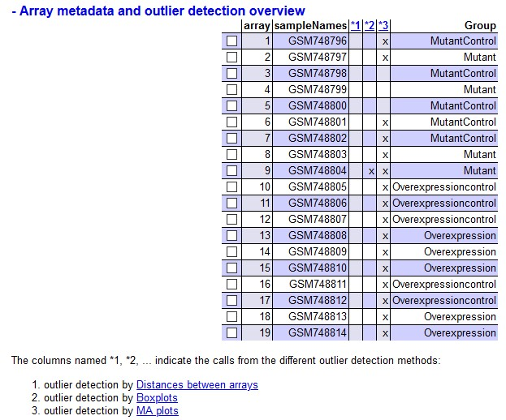
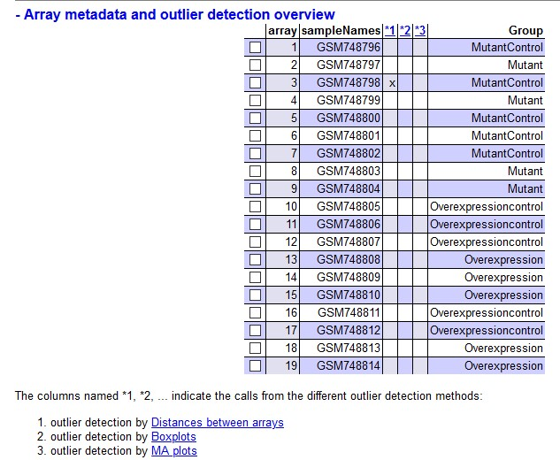
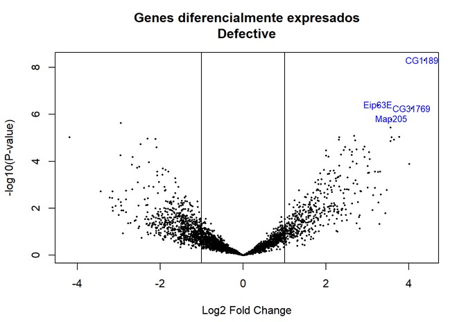

```{r setup, include=FALSE}
knitr::opts_chunk$set(echo = TRUE)
```


<font size ="5">
**Artículo:** Tramtrack Is Genetically Upstream of Genes Controlling Tracheal Tube Size in *Drosophila* 

**PMID:** 22216153
GEO accession: GSE30239

**Enlace a GitHub:**https://github.com/alexarredondodentaid/PEC1_ADO
</font>

# Abstract

El factor de transcripción Tramtrack (Ttk) de *Drosophila* está involucrado en diversas vías de desarrollo celular. Para caracterizarlo más en profundidad, en este estudio se analizaron los componentes genéticos que podrían verse alterados en la tráquea de mutantes defectivos para Ttk. Al analizar el transcriptoma encontraron grandes cambios, los cuales fueron confirmados mediante qPCR.

# Objetivos

Los objetivos de este estudio fueron los de profundizar en el conocimiento del factor de transcripción Ttk, y cuál es el papel que juega sobre el transcriptoma de las células que conforman la tráquea de *Drosophila*.

# Materiales y métodos

Se trabajó con 19 muestras (con 2-3 replicados por muestra) con 4 tipos de muestra:

· Mutante (ttk2D50 btl-enh-RFPmoe)

· Control de mutante (btl-enh-RFPmoe)

· Sobreexpresión (btl-GAL4; UAS-ttk, btl-enh-RFPmoe)

· Control de sobreexpresión (btl-GAL4; btl-enh-RFPmoe)

Emplearon el chip de Affymetrix GeneChip 2.0 *Drosophila* Genoma Arrays por triplicado. Los resultados los analizaron en *R* mediante Bioconductor. Los genes que mostraron expresión diferencial fueron confirmados mediante qPCR.

## Análisis realizado en la PEC

```{r include=FALSE}
# Preparamos el sistema de archivos
setwd(".")
dir.create("data")
dir.create("results")
```


```{r include=FALSE}
# Leemos el archivo targets que hemos preparado
targets <- read.csv2("./data/targets.csv", header = TRUE, sep = ";")

# Leemos los archivos .CEL
library(oligo)
celFiles <- list.celfiles("./data", full.names = TRUE)

library(Biobase)
my.targets <- read.AnnotatedDataFrame(file.path("./data", "targets.csv"), header = TRUE, row.names = 1, sep= ";")
rawData <- read.celfiles(celFiles, phenoData = my.targets)
```


```{r include=FALSE}
# Realizamos el control de calidad
library(arrayQualityMetrics)
#######arrayQualityMetrics(rawData)

# Vemos que hay 16 arrays con outliers, de los cuales 1 ha detectado outliers mediante 2 métodos de detección (ver screenshot 1). Hacemos un análisis más en profundidad:

boxplot(rawData, cex.axis = 0.5, las = 2, which = "all", main = "Distribución de valores de intensidad crudos")

# Observamos cierta variabilidad, pero es de esperar en datos crudos, veremos después de la normalización. Lo hacemos mediante el método RMA

eset_rma <- rma(rawData)

# Realizamos un nuevo control de calidad, esta vez sobre los datos normalizados

######arrayQualityMetrics(eset_rma, outdir = file.path("./results", "QCDir.Norm"), force = TRUE)

# Observamos que los outliers han disminuido mucho. Realizamos de nuevo un boxplot para ver como se distribuyen los valores de intesidad una vez normalizados:

boxplot(eset_rma, cex.axis = 0.5, las = 2, which = "all", main = "Distribución de valores de intensidad normalizados")

# Vemos que los boxplots son prácticamente idénticos y por lo tanto podemos comparar los datos normalizados.
```


```{r include=FALSE}
# Ahora detectamos aquellos genes más variables dentro de las muestras

sds <- apply(exprs(eset_rma), 1, sd)
sds0 <- sort(sds)
plot(1:length(sds0), sds0, main = "Distribución de variabilidad de los genes", sub = "Las línias verticales indican los percentiles 90% y 95%", xlab = "Índice de genes (de menos a más variable)", ylab = "Desviación estándar")
abline(v = length(sds)*c(0.9,0.95))

# Ahora filtramos aquellos genes menos variables

library(genefilter)
library(drosophila2.db)
annotation(eset_rma) <- "drosophila2.db"
filtered <- nsFilter(eset_rma, require.entrez = TRUE, remove.dupEntrez = TRUE, var.filter = TRUE, var.func = IQR, var.cutoff = 0.75, filterByQuantile = TRUE, feature.exclude = "ÂFFX")

print(filtered$filter.log)
eset_filtered <- filtered$eset

# Guardamos los datos normalizados

write.csv(exprs(eset_rma), file="./results/normalized.Data.csv")
write.csv(exprs(eset_filtered), file="./results/normalized.Filtered.Data.csv")
save(eset_rma, eset_filtered, file = "./results/normalized.Data.Rda")
```


```{r include=FALSE}
# Diseñamos la matriz de diseño
load(file="./results/normalized.Data.Rda")
library(limma)
designMat <- model.matrix(~0+Group, pData(eset_filtered))
colnames(designMat) <- c("Mutant", "MutantControl","Overexpression","Overexpressioncontrol")
designMat
print(designMat)

cont.matrix <- makeContrasts(Defective = Mutant-MutantControl, Overexpressed = Overexpression-Overexpressioncontrol,  levels=designMat)
print(cont.matrix)
```


```{r include=FALSE}
# Ahora hacemos las estimaciones
fit <- lmFit(eset_filtered, designMat)
fit.main <- contrasts.fit(fit, cont.matrix)
fit.main <- eBayes(fit.main)

# Y ahora obtenemos la lista de los genes expresados diferencialente
topTab_Mutant <- topTable(fit.main, number = nrow(fit.main), coef = "Defective", adjust = "fdr")
topTab_Overexpressed <- topTable(fit.main, number = nrow(fit.main), coef = "Overexpressed", adjust = "fdr")
```


```{r eval=FALSE, include=FALSE}
# Comprobamos los primeros de la lista:
head(topTab_Mutant)
head(topTab_Overexpressed)

# Ahora anotamos los genes:
require(annaffy)
genesSelected_Mutant <- rownames(topTab_Mutant)
at <- aafTableAnn(genesSelected_Mutant, "drosophila2.db")
saveHTML (at, file.path(resultsDir, "anotations_mutant.html"), "Annotations for selected genes")

genesSelected_Overexpressed <- rownames(topTab_Overexpressed)
at <- aafTableAnn(genesSelected_Overexpressed, "drosophila2.db")
saveHTML (at, file.path(resultsDir, "anotations_overexpressed.html"), "Annotations for selected genes")
```


```{r include=FALSE}
# Visualizamos la expresión diferencial
library(drosophila2.db)
geneSymbols  <- select(drosophila2.db, rownames(fit.main), c("SYMBOL"))
SYMBOLS <- geneSymbols$SYMBOL
volcanoplot(fit.main, coef=1, highlight=4, names=SYMBOLS, main=paste("Genes diferencialmente expresados", colnames(cont.matrix)[1],sep="\n"))
abline(v=c(-1,1))

volcanoplot(fit.main, coef=1, highlight=4, names=SYMBOLS, main=paste("Genes diferencialmente expresados", colnames(cont.matrix)[2],sep="\n"))
abline(v=c(-1,1))
```


```{r include=FALSE}
# Realizamos las comparaciones múltiples
library(limma)
res <- decideTests(fit.main, method="separate", adjust.method="fdr", p.value=0.1, lfc=1)
sum.res.rows <- apply(abs(res),1,sum)
res.selected <- res[sum.res.rows!=0,]
print(summary(res))

# Lo visualizamos en un diagrama de Venn
vennDiagram (res.selected[,1:2], cex=0.9)
title("Genes en común entre las dos comparaciones\n Genes seleccionados con FDR < 0.1 y logFC > 1")
```


```{r include=FALSE}
# Realizamos un heatmap para ver los genes que han mostrado expresión diferencial

probesInHeatmap <- rownames(res.selected)
HMdata <- exprs(eset_filtered)[rownames(exprs(eset_filtered)) %in% probesInHeatmap,]
geneSymbols <- select(drosophila2.db, rownames(HMdata), c("SYMBOL"))
SYMBOLS <- geneSymbols$SYMBOL
rownames(HMdata) <- SYMBOLS
write.csv(HMdata, file = file.path("./results/data4Heatmap.csv"))

my_palette <- colorRampPalette(c("blue", "red"))(n = 299)
library(gplots)
heatmap.2(as.matrix(HMdata), Rowv = FALSE, Colv = FALSE, main = "Genes diferencialmente expresados \n FDR < 0.1, logFC >=1", scale = "row", col = my_palette, sepcolor = "white", sepwidth = c(0.05,0.05), cexRow = 0.5, cexCol = 0.9, key = TRUE, keysize = 1.5, density.info = "histogram", tracecol = NULL, dendrogram = "none", srtCol = 30)
```


```{r include=FALSE}
# Estudiamos la significancia biológica de los resultados
listOfTables <- list(Defective =  topTab_Mutant, Overexpressed = topTab_Overexpressed)
listOfSelected <- list()
for(i in 1:length(listOfTables)){
  topTab <- listOfTables[[i]]
  whichGenes <- topTab["adj.P.Val"]<0.15
  selectedIDs <- rownames(topTab)[whichGenes]
  EntrezIDs <- select(drosophila2.db, selectedIDs, c("ENTREZID"))
  EntrezIDs <- EntrezIDs$ENTREZID
  listOfSelected[[i]] <- EntrezIDs
  names(listOfSelected)[i] <- names(listOfTables)[i]
}

sapply(listOfSelected, length)

mapped_genes2GO <- mappedkeys(org.Dm.egGO)
mapped_genes2KEGG <- mappedkeys(org.Dm.egPATH)
mapped_genes <- union(mapped_genes2GO , mapped_genes2KEGG)

library(ReactomePA)

listOfData <- listOfSelected[1:2]
comparisonsNames <- names(listOfData)
universe <- mapped_genes

for (i in 1:length(listOfData)){
 genesIn <- listOfData[[i]]
 comparison <- comparisonsNames[i]
 enrich.result <- enrichPathway(gene = genesIn, pvalueCutoff = 0.05, readable = T, pAdjustMethod = "BH", organism = "fly", universe = universe)
 print(enrich.result)
}

write.csv(as.data.frame(enrich.result), file="./results/enrichresult.csv", row.names = FALSE)

cnetplot(enrich.result, categorySize = "geneNum", schowCategory = 15, vertex.label.cex = 0.75)
```

### Preparación de archivos

En primer descargamos los archivos .CEL asociados al estudio y creamos un archivo "targets.csv" de acuerdo con los archivos .CEL.  

### Control de calidad y normalización

A continuación, comprobamos la variabilidad dentro de los datos observados, lo cual nos da esta información:

```{r echo=FALSE, out.width='75%', fig.align='center'}

```

```{r echo=FALSE}
boxplot(rawData, cex.axis = 0.5, las = 2, which = "all", main = "Distribución de valores de intensidad crudos")
```

Interpretando la tabla y el boxplot vemos que hay cierta variabilidad, la cual habrá que ver si se mantiene después de la normalización de los datos. 
A continuación normalizamos los datos mediante el método RMA y volvemos a comprobar la variabilidad:

```{r echo=FALSE, out.width='75%', fig.align='center'}

```

```{r echo=FALSE}
boxplot(eset_rma, cex.axis = 0.5, las = 2, which = "all", main = "Distribución de valores de intensidad normalizados")
```

Esta vez vemos que hay muchísima menos variabilidad y por lo tanto podemos seguir con el análisis. 

### Selección de genes con expresión diferencial

A partir de los datos normalizados, y utilizando la base de datos de los genes asociados al chip del estudio, logramos una lista que incluye los genes estudiados y su valor de expresión. Al enfrentar esta lista a una matriz de diseño y posteriormente a una matriz de contraste, obtenemos una tabla que contiene, entre otras, el valor estadístico de aquellos genes que han sufrido sobre o subexpresión respecto a su control.

### Anotación de los genes

Para asociar cada identidad del chip a otros valores que se encuentran en otras bases de datos, utilizamos el paquete `annafy` sobre la tabla que hemos realizado en el paso anterior. Este paquete añadirá, entre otros, el nombre del gen asociado a la sonda del chip, la Gene Ontology, etc. 

### Visualizaciones gráficas de la expresión diferencial

Para observar visualmente la expresión diferencial podemos hacer distintos gráficos. En nuestro análisis hemos hecho un heatmpa, un volcanoplot y un vennDiagram mediante el paquete `limma`. Los gráficos se pueden consultar en el apartado de resultados. 

### Significancia biológica de los resultados

Para determinar que implicaciones biológicas tiene la expresión diferencial de los genes de nuestro estudio, podemos realizar un gráfico mediante la función `enrichPathway` disponible en el paquete `ReactomePA`. Esta función utiliza las bases de datos disponibles del organismos que estemos utilizando y las cruza con los genes que más expresión diferencial han sufrido en nuestro análisis. El gráfico se puede consultar en el apartado de resultados.

# Resultados

En este análisis pudimos determinar que la deleción y la sobreexpresión del gen que codifica para el factor de transcripción Tramtrack provoca cambios en la expresión de otros genes (ver archivos annotations_mutant.html y annotations_overexpressed.html para una lista de los genes). De estos genes diferencialmente expresados, pudimos ver que algunos sufrían una mayor expresión y otros una menor expresión respecto a su control, tal y como se puede observar en la siguiente tabla y heatmap:

```{r echo=FALSE}
print(summary(res))
```

```{r echo=FALSE}
heatmap.2(as.matrix(HMdata), Rowv = FALSE, Colv = FALSE, main = "Genes diferencialmente expresados \n FDR < 0.1, logFC >=1", scale = "row", col = my_palette, sepcolor = "white", sepwidth = c(0.05,0.05), cexRow = 0.5, cexCol = 0.9, key = TRUE, keysize = 1.5, density.info = "histogram", tracecol = NULL, dendrogram = "none", srtCol = 30)
```

Al comparar los genes con expresión diferencial en aquellas muestras defectivas para Ttk y aquellas con Ttk sobreexpresado, pudimos comprobar que había 4 genes que sufrían expresión diferencial en ambos casos (concretamente sobreexpresión). 

```{r echo=FALSE}
vennDiagram (res.selected[,1:2], cex=0.9)
title("Genes en común entre las dos comparaciones\n Genes seleccionados con FDR < 0.1 y logFC > 1")
```

Concretamente, como se puede observar en el siguiente Volcanoplot, fueron los genes CG1189, Eip63E, CG31769 y Map205.

```{r echo=FALSE, out.width='75%', fig.align='center'}

```

Estos genes, al analizar su función biológica (disponible en los archivos annotations_mutant.html y annotations_overexpressed.html en la columna Gene Ontology) están asociadas a funciones diversas, de entre las que quizás tienen en común ciertos procesos de desarrollo celular.

De entre todos los genes con expresión diferencial se pudo observar que aquellos procesos biológicos más afectados por la alteración en la expresión de Ttk fueron los que se presentan en el siguiente gráfico.

```{r echo=FALSE}
cnetplot(enrich.result, categorySize = "geneNum", schowCategory = 15, vertex.label.cex = 0.75)
```

# Discusión

Los resultados obtenidos por el estudio inicial y los nuestros difieren, aunque probablemente sea por el pipeline elegido. Al comprobar el material y métodos empleado en el estudio, se ve como utilizan scripts escritos en PERL de fabricación propia y otras bases de datos distintas a las empleadas en nuestro análisis. Teniendo en cuenta que tres de los cuatro genes con expresión diferencial compartidos en ambos tipos de poblaciones tienen funciones biológicas asociadas al desarrollo celular, se podría hipotetizar que los genes que se han detectado mediante nuestro análisis también pueden tener un papel en el desarrollo traqueal de *Drosophila*. Sin embargo, esto requeriría estudios adicionales como los que se llevaron a cabo en el artículo original. 

# Apéndice

Código anotado empleado en nuestro estudio:

```{r eval=FALSE}
# Preparamos el sistema de archivos
setwd(".")
dir.create("data")
dir.create("results")

# Leemos el archivo targets que hemos preparado
targets <- read.csv2("./data/targets.csv", header = TRUE, sep = ";")

# Leemos los archivos .CEL
library(oligo)
celFiles <- list.celfiles("./data", full.names = TRUE)

library(Biobase)
my.targets <- read.AnnotatedDataFrame(file.path("./data", "targets.csv"), header = TRUE, row.names = 1, sep= ";")
rawData <- read.celfiles(celFiles, phenoData = my.targets)

# Realizamos el control de calidad
library(arrayQualityMetrics)
#######arrayQualityMetrics(rawData)

# Vemos que hay 16 arrays con outliers, de los cuales 1 ha detectado outliers mediante 2 métodos de detección (ver screenshot 1). Hacemos un análisis más en profundidad:

boxplot(rawData, cex.axis = 0.5, las = 2, which = "all", main = "Distribución de valores de intensidad crudos")

# Observamos cierta variabilidad, pero es de esperar en datos crudos, veremos después de la normalización. Lo hacemos mediante el método RMA

eset_rma <- rma(rawData)

# Realizamos un nuevo control de calidad, esta vez sobre los datos normalizados

arrayQualityMetrics(eset_rma, outdir = file.path("./results", "QCDir.Norm"), force = TRUE)

# Observamos que los outliers han disminuido mucho. Realizamos de nuevo un boxplot para ver como se distribuyen los valores de intesidad una vez normalizados:

boxplot(eset_rma, cex.axis = 0.5, las = 2, which = "all", main = "Distribución de valores de intensidad normalizados")

# Vemos que los boxplots son prácticamente idénticos y por lo tanto podemos comparar los datos normalizados.

# Ahora detectamos aquellos genes más variables dentro de las muestras

sds <- apply(exprs(eset_rma), 1, sd)
sds0 <- sort(sds)
plot(1:length(sds0), sds0, main = "Distribución de variabilidad de los genes", sub = "Las línias verticales indican los percentiles 90% y 95%", xlab = "Índice de genes (de menos a más variable)", ylab = "Desviación estándar")
abline(v = length(sds)*c(0.9,0.95))

# Ahora filtramos aquellos genes menos variables

library(genefilter)
library(drosophila2.db)
annotation(eset_rma) <- "drosophila2.db"
filtered <- nsFilter(eset_rma, require.entrez = TRUE, remove.dupEntrez = TRUE, var.filter = TRUE, var.func = IQR, var.cutoff = 0.75, filterByQuantile = TRUE, feature.exclude = "ÂFFX")

print(filtered$filter.log)
eset_filtered <- filtered$eset

# Guardamos los datos normalizados

write.csv(exprs(eset_rma), file="./results/normalized.Data.csv")
write.csv(exprs(eset_filtered), file="./results/normalized.Filtered.Data.csv")
save(eset_rma, eset_filtered, file = "./results/normalized.Data.Rda")

# Diseñamos la matriz de diseño
load(file="./results/normalized.Data.Rda")
library(limma)
designMat <- model.matrix(~0+Group, pData(eset_filtered))
colnames(designMat) <- c("Mutant", "MutantControl","Overexpression","Overexpressioncontrol")
designMat
print(designMat)

cont.matrix <- makeContrasts(Defective = Mutant-MutantControl, Overexpressed = Overexpression-Overexpressioncontrol,  levels=designMat)
print(cont.matrix)

# Ahora hacemos las estimaciones
fit <- lmFit(eset_filtered, designMat)
fit.main <- contrasts.fit(fit, cont.matrix)
fit.main <- eBayes(fit.main)

# Y ahora obtenemos la lista de los genes expresados diferencialente
topTab_Mutant <- topTable(fit.main, number = nrow(fit.main), coef = "Defective", adjust = "fdr")
topTab_Overexpressed <- topTable(fit.main, number = nrow(fit.main), coef = "Overexpressed", adjust = "fdr")

# Comprobamos los primeros de la lista:
head(topTab_Mutant)
head(topTab_Overexpressed)

# Ahora anotamos los genes:
require(annaffy)
genesSelected_Mutant <- rownames(topTab_Mutant)
at <- aafTableAnn(genesSelected_Mutant, "drosophila2.db")
saveHTML (at, file.path(resultsDir, "anotations_mutant.html"), "Annotations for selected genes")

genesSelected_Overexpressed <- rownames(topTab_Overexpressed)
at <- aafTableAnn(genesSelected_Overexpressed, "drosophila2.db")
saveHTML (at, file.path(resultsDir, "anotations_overexpressed.html"), "Annotations for selected genes")

# Visualizamos la expresión diferencial
library(drosophila2.db)
geneSymbols  <- select(drosophila2.db, rownames(fit.main), c("SYMBOL"))
SYMBOLS <- geneSymbols$SYMBOL
volcanoplot(fit.main, coef=1, highlight=4, names=SYMBOLS, main=paste("Genes diferencialmente expresados", colnames(cont.matrix)[1],sep="\n"))
abline(v=c(-1,1))

volcanoplot(fit.main, coef=1, highlight=4, names=SYMBOLS, main=paste("Genes diferencialmente expresados", colnames(cont.matrix)[2],sep="\n"))
abline(v=c(-1,1))

# Realizamos las comparaciones múltiples
library(limma)
res <- decideTests(fit.main, method="separate", adjust.method="fdr", p.value=0.1, lfc=1)
sum.res.rows <- apply(abs(res),1,sum)
res.selected <- res[sum.res.rows!=0,]
print(summary(res))

# Lo visualizamos en un diagrama de Venn
vennDiagram (res.selected[,1:2], cex=0.9)
title("Genes en común entre las dos comparaciones\n Genes seleccionados con FDR < 0.1 y logFC > 1")

# Realizamos un heatmap para ver los genes que han mostrado expresión diferencial

probesInHeatmap <- rownames(res.selected)
HMdata <- exprs(eset_filtered)[rownames(exprs(eset_filtered)) %in% probesInHeatmap,]
geneSymbols <- select(drosophila2.db, rownames(HMdata), c("SYMBOL"))
SYMBOLS <- geneSymbols$SYMBOL
rownames(HMdata) <- SYMBOLS
write.csv(HMdata, file = file.path("./results/data4Heatmap.csv"))

my_palette <- colorRampPalette(c("blue", "red"))(n = 299)
library(gplots)
heatmap.2(as.matrix(HMdata), Rowv = FALSE, Colv = FALSE, main = "Genes diferencialmente expresados \n FDR < 0.1, logFC >=1", scale = "row", col = my_palette, sepcolor = "white", sepwidth = c(0.05,0.05), cexRow = 0.5, cexCol = 0.9, key = TRUE, keysize = 1.5, density.info = "histogram", tracecol = NULL, dendrogram = "none", srtCol = 30)

# Estudiamos la significancia biológica de los resultados
listOfTables <- list(Defective =  topTab_Mutant, Overexpressed = topTab_Overexpressed)
listOfSelected <- list()
for(i in 1:length(listOfTables)){
  topTab <- listOfTables[[i]]
  whichGenes <- topTab["adj.P.Val"]<0.15
  selectedIDs <- rownames(topTab)[whichGenes]
  EntrezIDs <- select(drosophila2.db, selectedIDs, c("ENTREZID"))
  EntrezIDs <- EntrezIDs$ENTREZID
  listOfSelected[[i]] <- EntrezIDs
  names(listOfSelected)[i] <- names(listOfTables)[i]
}

sapply(listOfSelected, length)

mapped_genes2GO <- mappedkeys(org.Dm.egGO)
mapped_genes2KEGG <- mappedkeys(org.Dm.egPATH)
mapped_genes <- union(mapped_genes2GO , mapped_genes2KEGG)

library(ReactomePA)

listOfData <- listOfSelected[1:2]
comparisonsNames <- names(listOfData)
universe <- mapped_genes

for (i in 1:length(listOfData)){
 genesIn <- listOfData[[i]]
 comparison <- comparisonsNames[i]
 enrich.result <- enrichPathway(gene = genesIn, pvalueCutoff = 0.05, readable = T, pAdjustMethod = "BH", organism = "fly", universe = universe)
 print(enrich.result)
}

write.csv(as.data.frame(enrich.result), file="./results/enrichresult.csv", row.names = FALSE)

cnetplot(enrich.result, categorySize = "geneNum", schowCategory = 15, vertex.label.cex = 0.75)
```

